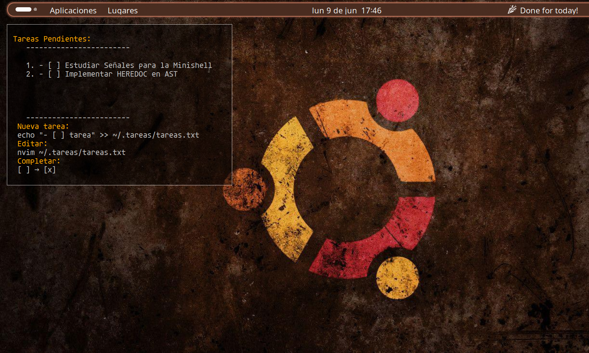

# Conky Tasks Widget

<p align="right">
  <a href="#english">English</a> | <a href="#español">Español</a>
</p>

---

## <a name="english"></a>🇬🇧 English

An elegant and functional widget to display and manage your pending tasks directly on your desktop using Conky.



## 🚀 Automatic Installation

### Option 1: Installation Script (Recommended)

```bash
# Clone or download the files
git clone https://github.com/SoMaxB/conky_tareas_widget.git
cd conky_tareas_widget

# Run the installer
chmod +x install.sh
./install.sh
```
One line command:
```bash
git clone https://github.com/SoMaxB/conky_tareas_widget.git && cd conky_tareas_widget && chmod +x install.sh && ./install.sh
```

### Option 2: Manual Installation

1. **Install dependencies:**
   ```bash
   # Ubuntu/Debian
   sudo apt update
   sudo apt install conky-all coreutils fonts-dejavu

   # Fedora
   sudo dnf install conky coreutils dejavu-sans-mono-fonts

   # Arch/Manjaro
   sudo pacman -S conky coreutils ttf-dejavu
   ```

2. **Set up directories:**
   ```bash
   mkdir -p ~/.tareas
   ```

3. **Create initial tasks file:**
   ```bash
   cat > ~/.tareas/tareas.txt << 'EOF'
   - [ ] Welcome to the task widget
   - [ ] Edit this file with: nvim ~/.tareas/tareas.txt
   - [ ] Mark tasks as completed by changing [ ] to [x]
   - [ ] Add new tasks with: echo "- [ ] new task" >> ~/.tareas/tareas.txt
   EOF
   ```

4. **Install configuration:**
   ```bash
   cp conkyrc ~/.conkyrc
   ```

5. **Start the widget:**
   ```bash
   conky -c ~/.conkyrc &
   ```

## 📋 Features

- **Clear visualization**: Numbered list of pending tasks
- **Automatic update**: Refreshes every 3 seconds
- **Transparency**: Semi-transparent background that doesn’t interfere with the desktop
- **Smart filtering**: Only shows non-empty lines
- **Positioning**: Top-left corner with configurable margins

## 🛠️ Usage

### Basic commands:

```bash
# Add new task
echo "- [ ] New task" >> ~/.tareas/tareas.txt

# Edit tasks
nvim ~/.tareas/tareas.txt
# or use your preferred editor:
gedit ~/.tareas/tareas.txt
nano ~/.tareas/tareas.txt

# Mark task as completed
# Change [ ] to [x] in the file

# Restart the widget
killall conky
conky -c ~/.conkyrc &
```

### Included scripts (if you used the installer):

```bash
# Start/restart widget
~/start_conky_tareas.sh

# The widget starts automatically upon login
```

## ⚙️ Configuration

### Customize position and appearance

Edit `~/.conkyrc` to modify:

- **Position**: Change `gap_x` and `gap_y`
- **Size**: Modify `minimum_width` and `maximum_width`
- **Transparency**: Adjust `own_window_argb_value` (0-255)
- **Font**: Change `font`
- **Colors**: Modify `${color}` values

### Task file structure

Expected format:
```
- [ ] Pending task
- [x] Completed task
- [ ] Another pending task
```

## 🔧 Dependencies

### System dependencies:
- `conky` - The widget engine
- `sed` - Text processing (included in coreutils)
- `nl` - Line numbering (included in coreutils)

### Fonts:
- `DejaVu Sans Mono` - Main font (usually pre-installed)

### File structure:
- `~/.conkyrc` - Main configuration
- `~/.tareas/` - Tasks directory
- `~/.tareas/tareas.txt` - Tasks file

## 🐛 Troubleshooting

### Widget does not appear:
```bash
# Check that conky is installed
conky --version

# Check configuration
conky -c ~/.conkyrc -t

# Start in debug mode
conky -c ~/.conkyrc -d
```

### Font issues:
```bash
# List available fonts
fc-list | grep -i dejavu

# If not installed, install:
sudo apt install fonts-dejavu  # Ubuntu/Debian
```

### Tasks file not found:
```bash
# Check existence
ls -la ~/.tareas/tareas.txt

# Create if missing
mkdir -p ~/.tareas
touch ~/.tareas/tareas.txt
```

## 📁 Project structure

```
conky-tareas-widget/
├── .conkyrc              # Main Conky configuration
├── install.sh            # Automatic installation script
├── README.md             # This file
└── preview.png           # Screenshot (optional)
```

## 🔄 Autostart

The installation script sets up autostart. If you installed manually:

1. **Create autostart script:**
   ```bash
   cat > ~/start_conky_tareas.sh << 'EOF'
   #!/bin/bash
   killall conky 2>/dev/null
   sleep 2
   conky -c ~/.conkyrc &
   EOF
   chmod +x ~/start_conky_tareas.sh
   ```

2. **Setup autostart:**
   ```bash
   mkdir -p ~/.config/autostart
   cat > ~/.config/autostart/conky-tareas.desktop << EOF
   [Desktop Entry]
   Type=Application
   Name=Conky Tasks Widget
   Exec=$HOME/start_conky_tareas.sh
   Hidden=false
   NoDisplay=false
   X-GNOME-Autostart-enabled=true
   EOF
   ```

## 🤝 Contributing

1. Fork the project
2. Create a branch for your feature (`git checkout -b feature/AmazingFeature`)
3. Commit your changes (`git commit -m 'Add some AmazingFeature'`)
4. Push to the branch (`git push origin feature/AmazingFeature`)
5. Open a Pull Request

## 📝 License

Distributed under the MIT License. See `LICENSE` for more information.

## 🙏 Credits

- [Conky](https://github.com/brndnmtthws/conky) - The awesome widget engine
- Linux community for command-line tools

---

**Questions or suggestions?** Open an [issue](https://github.com/SoMaxB/conky_tareas_widget/issues) on GitHub.

---

## <a name="español"></a>🇪🇸 Español

Un widget elegante y funcional para mostrar y gestionar tus tareas pendientes directamente en el escritorio usando Conky.


## 🚀 Instalación Automática

### Opción 1: Script de instalación (Recomendado)

```bash
# Clona o descarga los archivos
git clone https://github.com/SoMaxB/conky_tareas_widget.git
cd conky_tareas_widget

# Ejecuta el instalador
chmod +x install.sh
./install.sh
```
Comando en una sola línea:
```bash
git clone https://github.com/SoMaxB/conky_tareas_widget.git && cd conky_tareas_widget && chmod +x install.sh && ./install.sh
```

### Opción 2: Instalación manual

1. **Instalar dependencias:**
   ```bash
   # Ubuntu/Debian
   sudo apt update
   sudo apt install conky-all coreutils fonts-dejavu

   # Fedora
   sudo dnf install conky coreutils dejavu-sans-mono-fonts

   # Arch/Manjaro
   sudo pacman -S conky coreutils ttf-dejavu
   ```

2. **Configurar directorios:**
   ```bash
   mkdir -p ~/.tareas
   ```

3. **Crear archivo de tareas inicial:**
   ```bash
   cat > ~/.tareas/tareas.txt << 'EOF'
   - [ ] Bienvenido al widget de tareas
   - [ ] Edita este archivo con: nvim ~/.tareas/tareas.txt
   - [ ] Marca las tareas completadas cambiando [ ] por [x]
   - [ ] Añade nuevas tareas con: echo "- [ ] nueva tarea" >> ~/.tareas/tareas.txt
   EOF
   ```

4. **Instalar configuración:**
   ```bash
   cp conkyrc ~/.conkyrc
   ```

5. **Iniciar el widget:**
   ```bash
   conky -c ~/.conkyrc &
   ```

## 📋 Características

- **Visualización clara**: Lista numerada de tareas pendientes
- **Actualización automática**: Se actualiza cada 3 segundos
- **Transparencia**: Fondo semi-transparente que no interfiere con el escritorio
- **Filtrado inteligente**: Solo muestra líneas no vacías
- **Posicionamiento**: Esquina superior izquierda con márgenes configurables

## 🛠️ Uso

### Comandos básicos:

```bash
# Añadir nueva tarea
echo "- [ ] Nueva tarea" >> ~/.tareas/tareas.txt

# Editar tareas
nvim ~/.tareas/tareas.txt
# o usa tu editor preferido:
gedit ~/.tareas/tareas.txt
nano ~/.tareas/tareas.txt

# Marcar tarea como completada
# Cambia [ ] por [x] en el archivo

# Reiniciar el widget
killall conky
conky -c ~/.conkyrc &
```

### Scripts incluidos (si usaste el instalador):

```bash
# Iniciar/reiniciar widget
~/start_conky_tareas.sh

# El widget se inicia automáticamente al hacer login
```

## ⚙️ Configuración

### Personalizar posición y apariencia

Edita `~/.conkyrc` para modificar:

- **Posición**: Cambia `gap_x` y `gap_y`
- **Tamaño**: Modifica `minimum_width` y `maximum_width`
- **Transparencia**: Ajusta `own_window_argb_value` (0-255)
- **Fuente**: Cambia `font`
- **Colores**: Modifica los valores `${color}`

### Estructura del archivo de tareas

El formato esperado es:
```
- [ ] Tarea pendiente
- [x] Tarea completada
- [ ] Otra tarea pendiente
```

## 🔧 Dependencias

### Dependencias del sistema:
- `conky` - El motor del widget
- `sed` - Procesamiento de texto (incluido en coreutils)
- `nl` - Numeración de líneas (incluido en coreutils)

### Fuentes:
- `DejaVu Sans Mono` - Fuente principal (generalmente pre-instalada)

### Estructura de archivos:
- `~/.conkyrc` - Configuración principal
- `~/.tareas/` - Directorio de tareas
- `~/.tareas/tareas.txt` - Archivo de tareas

## 🐛 Solución de problemas

### El widget no aparece:
```bash
# Verificar que conky esté instalado
conky --version

# Verificar configuración
conky -c ~/.conkyrc -t

# Iniciar en modo debug
conky -c ~/.conkyrc -d
```

### Problemas de fuentes:
```bash
# Listar fuentes disponibles
fc-list | grep -i dejavu

# Si no está instalada, instalar:
sudo apt install fonts-dejavu  # Ubuntu/Debian
```

### El archivo de tareas no se encuentra:
```bash
# Verificar que existe
ls -la ~/.tareas/tareas.txt

# Crearlo si no existe
mkdir -p ~/.tareas
touch ~/.tareas/tareas.txt
```

## 📁 Estructura del proyecto

```
conky-tareas-widget/
├── .conkyrc              # Configuración principal de Conky
├── install.sh            # Script de instalación automática
├── README.md             # Este archivo
└── preview.png           # Captura de pantalla (opcional)
```

## 🔄 Inicio automático

El script de instalación configura el inicio automático. Si instalaste manualmente:

1. **Crear script de inicio:**
   ```bash
   cat > ~/start_conky_tareas.sh << 'EOF'
   #!/bin/bash
   killall conky 2>/dev/null
   sleep 2
   conky -c ~/.conkyrc &
   EOF
   chmod +x ~/start_conky_tareas.sh
   ```

2. **Configurar autostart:**
   ```bash
   mkdir -p ~/.config/autostart
   cat > ~/.config/autostart/conky-tareas.desktop << EOF
   [Desktop Entry]
   Type=Application
   Name=Conky Tareas Widget
   Exec=$HOME/start_conky_tareas.sh
   Hidden=false
   NoDisplay=false
   X-GNOME-Autostart-enabled=true
   EOF
   ```

## 🤝 Contribuir

1. Fork el proyecto
2. Crea una rama para tu feature (`git checkout -b feature/AmazingFeature`)
3. Commit tus cambios (`git commit -m 'Add some AmazingFeature'`)
4. Push a la rama (`git push origin feature/AmazingFeature`)
5. Abre un Pull Request

## 📝 Licencia

Distribuido bajo la licencia MIT. Ver `LICENSE` para más información.

## 🙏 Reconocimientos

- [Conky](https://github.com/brndnmtthws/conky) - El fantástico motor de widgets
- Comunidad de Linux por las herramientas de línea de comandos

---

**¿Problemas o sugerencias?** Abre un [issue](https://github.com/SoMaxB/conky_tareas_widget/issues) en GitHub.

```

---

¿Quieres que también lo suba como un commit/pull request, o solo necesitas el archivo para reemplazarlo manualmente?
